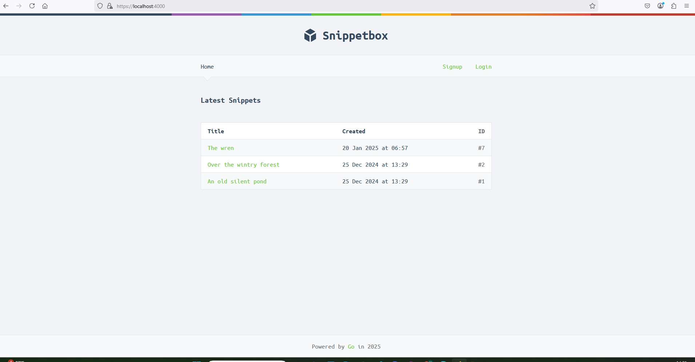
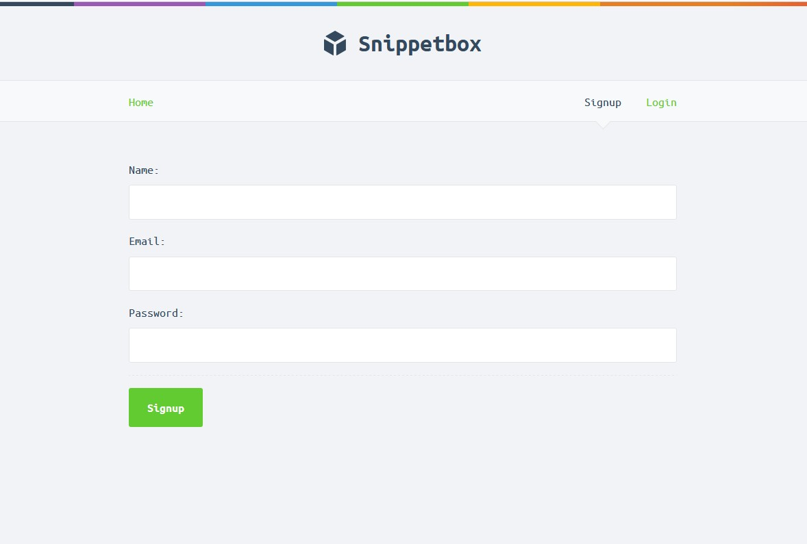

# 📦 Snippet Box

A simple snippet-sharing web application built in Go. Users can register, log in, and create or view code snippets. This project follows modern Go web development practices, inspired by the book *Let Go* by Alex Edwards.

## 🚀 Features

- Create and view code snippets
- User authentication with login and logout
- Secure, encrypted session management using cookies
- CSRF protection and input validation
- Server-side HTML rendering using Go’s `html/template` package

## 🛠 Technologies Used

- **Go** – Backend programming language
- **MySQL** – Relational database for storing snippets and user data
- **HTML/CSS** – Basic frontend

## 📚 What I Learned

- Building secure and maintainable web apps using Go
- Managing sessions and authentication using encrypted cookies
- Connecting Go with a MySQL database using `database/sql`
- Structuring Go applications with separation of concerns and clear routing

## 📷 Screenshot





## 📝 How to Run

```bash
go run ./cmd/web

